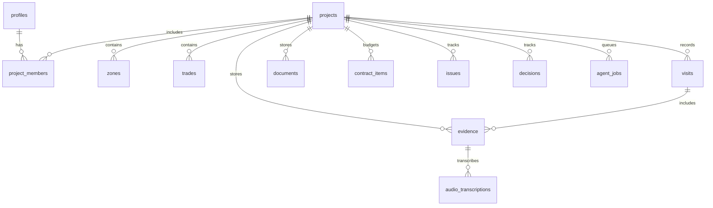

# Data Model

Phase 0 does not create database tables. The first real schema arrives in Phase 1 with Supabase migrations and RLS.

## Planned Tables

- profiles
- projects
- project_members
- zones
- trades
- visits
- evidence
- documents
- contract_items
- audio_transcriptions
- issues
- decisions
- agent_jobs
- audit_log

## Planned Diagram

## Phase 1 Direction

Phase 1 should add enums, migrations, project-membership based RLS, synthetic seed data, and matching schemas in `packages/core`.
