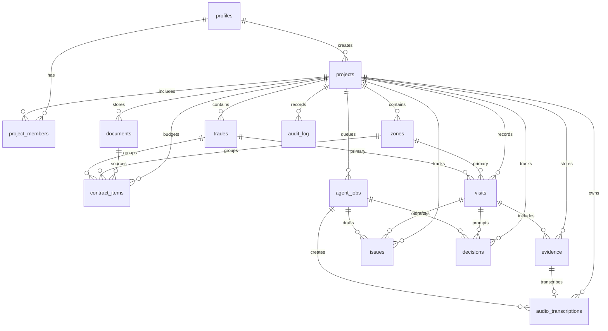

# Data Model

Phase 1 creates the initial Supabase schema in `supabase/migrations/20260703093000_initial_schema_rls.sql`.

## Enums

- `project_role`: owner, admin, editor, viewer
- `project_status`: active, paused, completed, archived
- `visit_status`: draft, published, archived
- `evidence_type`: photo, audio, video, document
- `document_type`: plan, quote, technical_memory, annex, invoice, warranty, change_order, other
- `issue_status`: ai_draft, open, in_review, waiting_builder, waiting_owner, resolved, closed, rejected
- `decision_status`: ai_draft, pending, approved, rejected, superseded, closed
- `priority`: low, medium, high, critical
- `job_type`: transcribe_audio, extract_visit, generate_visit_summary, suggest_issues, suggest_decisions, generate_weekly_summary
- `job_status`: pending, processing, completed, failed, cancelled

## Tables

- profiles
- projects
- project_members
- zones
- trades
- visits
- evidence
- documents
- contract_items
- audio_transcriptions
- issues
- decisions
- agent_jobs
- audit_log

## Diagram

## Notes

- `profiles.id` references `auth.users.id`.
- Project access is controlled through `project_members`.
- `address_label` is intentionally a label, not a full address requirement.
- `evidence` stores file metadata. Photos are evidence only; no MVP image analysis fields exist.
- `audio_transcriptions` stores raw and editable transcript text.
- `agent_jobs` stores async job state for future worker processing.
- `issues` and `decisions` include `review_state` and `source` so AI drafts stay reviewable.
- `audit_log` is append-oriented. Authenticated users can insert their own audit events; service-role code can insert system events later.
