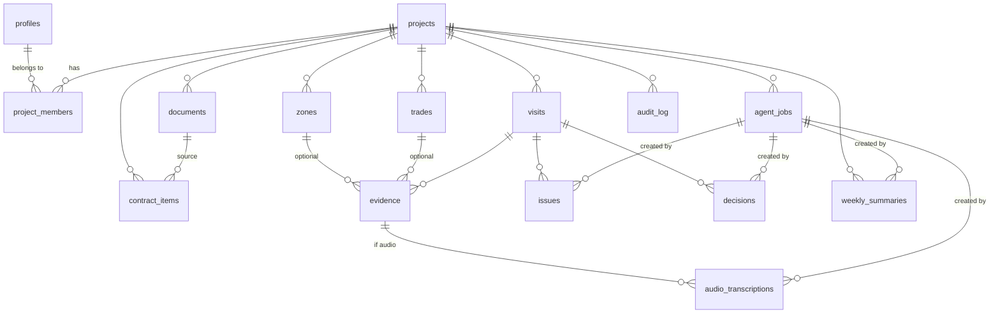

# Data model

> Status: **implemented through Phase 8**. Source of truth:
> [supabase/migrations/](../../supabase/migrations/) — enums, tables and RLS are fully
> commented there. TypeScript mirrors live in
> [packages/core/src/enums.ts](../../packages/core/src/enums.ts); form and CSV validators live in
> [packages/core/src/forms.ts](../../packages/core/src/forms.ts).

## Tables

| Table                  | Purpose                                                     |
| ---------------------- | ----------------------------------------------------------- |
| `profiles`             | User profile linked to `auth.users`                         |
| `projects`             | Renovation project                                          |
| `project_members`      | Memberships and roles per project (basis for RLS policies)  |
| `zones`                | Zones/rooms (kitchen, main bathroom, living room…)          |
| `trades`               | Trades (electrical, plumbing, carpentry…)                   |
| `visits`               | Site visits                                                 |
| `evidence`             | Evidence (photos, audio, video, documents) for a visit      |
| `audio_transcriptions` | Transcriptions (original + edited) of audio                 |
| `documents`            | Technical documents (plan, quote, technical specification…) |
| `contract_items`       | Budget line items                                           |
| `issues`               | Issues                                                      |
| `decisions`            | Pending decisions                                           |
| `weekly_summaries`     | Reviewable weekly project summaries generated by the worker |
| `agent_jobs`           | AI worker job queue                                         |
| `audit_log`            | Append-only log of relevant actions                         |

## Enums

Defined in `20260702120000_create_enums.sql` and mirrored in `packages/core`:

- `project_role`: owner, admin, editor, viewer
- `project_status`: active, paused, completed, archived
- `visit_status`: draft, published, archived
- `evidence_type`: photo, audio, video, document
- `document_type`: plan, quote, technical_memory, annex, invoice, warranty, change_order, other
- `issue_status`: ai_draft, open, in_review, waiting_builder, waiting_owner, resolved, closed, rejected
- `decision_status`: ai_draft, pending, approved, rejected, superseded, closed
- `priority`: low, medium, high, critical
- `job_type`: transcribe_audio, extract_visit, generate_visit_summary, suggest_issues, suggest_decisions, generate_weekly_summary
- `job_status`: pending, processing, completed, failed, cancelled

`review_state` (human_created, ai_draft, approved, edited, rejected) and `source` (human, ai)
are intentionally **text columns**, not SQL enums: the review workflow is still being built out
(Phases 6–7) and text keeps them cheap to evolve. They are validated app-side with Zod.

## Relationships

## SQL functions (RPC)

Implemented RPCs:

| Function                                            | Caller      | Purpose                                             |
| --------------------------------------------------- | ----------- | --------------------------------------------------- |
| `create_project_with_owner(name, label?, desc?)`    | Web app     | Project + owner membership in one transaction       |
| `add_project_member_by_email(project, email, role)` | Web app     | Owner/admin adds an existing user, audit-logged     |
| `claim_agent_job(worker, types, stale_after)`       | Worker only | Atomically claims pending/stale jobs with row locks |

## Storage

Phases 3 and 4 create two private buckets:

| Bucket              | Purpose                                               | Path convention                                  |
| ------------------- | ----------------------------------------------------- | ------------------------------------------------ |
| `project-documents` | Plans, quotes, invoices, warranties, annexes          | `<project_id>/<uuid>-<safe-filename>`            |
| `visit-evidence`    | Photos, audio, video and document evidence for visits | `<project_id>/<visit_id>/<uuid>-<safe-filename>` |

The `documents.storage_path` and `evidence.storage_path` columns store the exact object path.
Server components generate short-lived signed URLs for members; files are never public. The
helper `storage_object_project_id(name)` safely parses the first folder segment for Storage RLS,
and `storage_object_visit_id(name)` parses the second segment for visit evidence uploads.

## Phase 3 screens and validators

- `/projects/[projectId]/setup`: create/edit/delete zones and trades.
- `/projects/[projectId]/documents`: upload private documents, edit metadata and delete files.
- `/projects/[projectId]/budget`: create/edit/delete `contract_items` manually and import CSV.
- CSV imports are validated with `parseBudgetCsv`. The importer accepts these headers:
  `code,title,description,trade,zone,quantity,unit,unit_price,total_amount,included_excluded,source_page,notes`.
  `trade` and `zone` values must match existing project setup names; imports never create setup
  data implicitly.

## Phase 4 screens and validators

- `/projects/[projectId]/visits`: create visits and review the visit log.
- `/projects/[projectId]/visits/[visitId]`: edit visit details, publish/archive/draft visits,
  upload evidence, preview signed evidence links and edit evidence metadata.
- Evidence files can be `photo`, `audio`, `video` or `document` and may link to an optional zone
  and trade. Upload MIME type, size and metadata are validated in server actions with Zod helpers
  from `packages/core`.
- Photos are stored and displayed only as evidence. Phase 4 does not add OCR, AI vision, photo
  analysis, transcription, worker polling or automatic issue/decision extraction.

## Phase 5 worker and transcription

- Editors can enqueue `transcribe_audio` jobs from audio evidence on the visit detail page.
- `apps/worker` claims jobs through `claim_agent_job()` using the service role key, downloads
  the private audio from `visit-evidence`, transcribes it and writes one canonical row to
  `audio_transcriptions`.
- `audio_transcriptions.evidence_id` is unique, so retries are idempotent if a worker crashes
  after inserting a transcript but before completing the job.
- Transcripts store `raw_transcript` plus editable `edited_transcript`. The visit page shows the
  transcript as reviewable text and lets editors save human edits.
- Phase 5 processes audio only. It does not add summaries, issue/decision extraction, OCR,
  photo analysis, Telegram or NanoClaw.

## Phase 6 textual AI extraction

- Editors can enqueue `generate_visit_summary`, `suggest_issues` and `suggest_decisions` from
  the visit detail page.
- All three jobs use `agent_jobs.input = { "visitId": "uuid" }` and are claimed by the worker
  through the existing `claim_agent_job()` RPC.
- `generate_visit_summary` writes reviewable text to `visits.summary`; editors can still edit
  the summary manually in the visit form.
- `suggest_issues` writes draft rows to `issues` with `status = 'ai_draft'`,
  `review_state = 'ai_draft'`, `source = 'ai'` and `created_by_job_id`.
- `suggest_decisions` writes draft rows to `decisions` with the same AI provenance fields.
- Drafts may reference existing zones, trades and budget line items, but only if the id is
  present in the worker's text context. Hallucinated ids fail validation before insertion.
- Phase 6 does not add new tables or migrations; the Phase 1 schema already included the
  necessary fields and enum values.

## Phase 7 dashboard and human review

- `/projects/[projectId]` is now the operational dashboard: recent visits, open issues, pending
  decisions, AI drafts, project data links, members and recent audit entries.
- AI summaries are reviewed on the `visits` row with Phase 7 metadata:
  `summary_source`, `summary_review_state`, `summary_created_by_job_id`, `summary_reviewed_by`
  and `summary_reviewed_at`.
- `generate_visit_summary` now writes `summary_source = 'ai'` and
  `summary_review_state = 'ai_draft'`; approving/editing/rejecting the summary updates those
  fields and writes `audit_log`.
- AI issue drafts move through existing `issues.review_state` and `issues.status`.
  Approve/edit moves the issue into `open`; reject moves it to `rejected`; close moves it to
  `closed`.
- AI decision drafts move through existing `decisions.review_state` and `decisions.status`.
  Approve moves the decision to `approved`; edit keeps it `pending`; reject moves it to
  `rejected`; close moves it to `closed`.

## Phase 8 weekly summaries

- Editors enqueue `generate_weekly_summary` jobs from the project dashboard with
  `agent_jobs.input = { "weekStart": "YYYY-MM-DD", "weekEnd": "YYYY-MM-DD" }`.
- The worker builds a text-only project/week context from visits in the requested range,
  reviewed visit summaries, open reviewed issues, pending/approved reviewed decisions,
  zones/trades, budget metadata and document metadata.
- The worker never downloads Storage objects for weekly summaries. It does not OCR documents,
  analyze photos, inspect images or parse document contents.
- Results are stored in `weekly_summaries` with `source = 'ai'`,
  `review_state = 'ai_draft'` and `created_by_job_id` pointing to the job that produced them.
- Owner/admin/editor roles can approve, edit or reject weekly summary drafts from the dashboard.
  Review actions update `reviewed_by`/`reviewed_at` and write `audit_log` entries.

## Phases 10-11 optional gateways

Telegram and NanoClaw add no project tables, Storage buckets, SQL functions, enums or RLS
policies. They are stateless web gateways that validate external payloads and forward normalized
command intents to first-party server APIs. They do not write directly to Supabase, do not upload
files, do not enqueue worker jobs and do not change the data model.

## Design notes

- **Every project data table carries `project_id`** with `on delete cascade`: deleting a project
  removes all its data, and RLS filters by membership on that column.
- **AI provenance**: AI-created rows carry `source = 'ai'`, `review_state = 'ai_draft'` and
  `created_by_job_id` pointing to the `agent_jobs` row. Flow: `ai_draft → edited/approved/rejected`.
- **AI summary provenance** mirrors that flow on `visits.summary_*` columns because summaries
  live on the visit row rather than in a separate table.
- **Weekly summary provenance** lives on `weekly_summaries`: `created_by_job_id` points to the
  worker job, and human review writes `reviewed_by` plus `reviewed_at`.
- **`updated_at` is automatic** via the `set_updated_at` trigger on every mutable table.
  `audit_log` has no `updated_at`: it is append-only.
- **Transcripts are never destroyed**: `raw_transcript` is immutable in practice (no client
  insert/delete policies); users edit `edited_transcript`. Text extraction prefers the edited
  version.
- **Worker queue**: `agent_jobs` has a partial index on `status = 'pending'` for the polling
  query, plus `locked_at`/`locked_by`/`attempt_count` fields. Phase 5 claims jobs atomically with
  `FOR UPDATE SKIP LOCKED` in `claim_agent_job()`.
- **Data minimization**: `projects.address_label` is a label ("Barcelona flat"), not a full
  postal address.
- Nullable references (`zone_id`, `trade_id`, `visit_id`, …) use `on delete set null` so deleting
  a zone or trade never destroys visits or evidence.
- Zone and trade names are case-insensitively unique inside each project. This prevents ambiguous
  CSV imports and keeps setup lists clean.
