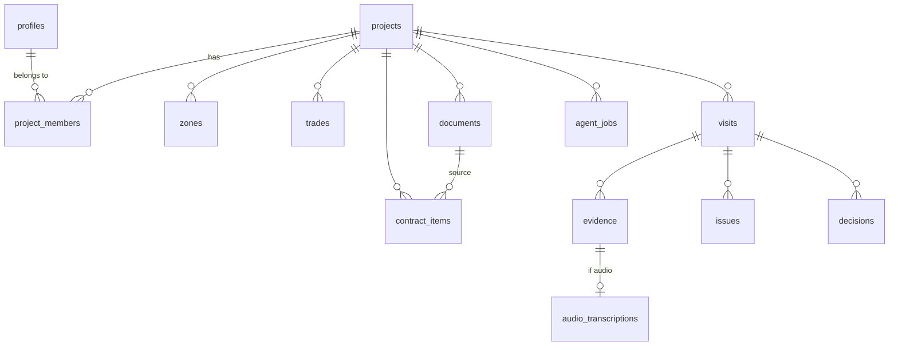

# Data model

> Status: preliminary design. Real migrations are created in **Phase 1**.

## Planned tables

| Table                  | Purpose                                                     |
| ---------------------- | ----------------------------------------------------------- |
| `profiles`             | User profile linked to `auth.users`                         |
| `projects`             | Renovation project                                          |
| `project_members`      | Memberships and roles per project (basis for RLS policies)  |
| `zones`                | Zones/rooms (kitchen, main bathroom, living room…)          |
| `trades`               | Trades (electrical, plumbing, carpentry…)                   |
| `visits`               | Site visits                                                 |
| `evidence`             | Evidence (photos, audio, video, documents) for a visit      |
| `audio_transcriptions` | Transcriptions (original + edited) of audio                 |
| `documents`            | Technical documents (plan, quote, technical specification…) |
| `contract_items`       | Budget line items                                           |
| `issues`               | Issues                                                      |
| `decisions`            | Pending decisions                                           |
| `agent_jobs`           | AI worker job queue                                         |
| `audit_log`            | Log of relevant actions                                     |

## Planned enums

- `project_role`: owner, admin, editor, viewer
- `project_status`: active, paused, completed, archived
- `visit_status`: draft, published, archived
- `evidence_type`: photo, audio, video, document
- `document_type`: plan, quote, technical_memory, annex, invoice, warranty, change_order, other
- `issue_status`: ai_draft, open, in_review, waiting_builder, waiting_owner, resolved, closed, rejected
- `decision_status`: ai_draft, pending, approved, rejected, superseded, closed
- `priority`: low, medium, high, critical
- `job_type`: transcribe_audio, extract_visit, generate_visit_summary, suggest_issues, suggest_decisions, generate_weekly_summary
- `job_status`: pending, processing, completed, failed, cancelled

## Main relationships

## Design notes

- AI-generated content is marked with `source = 'ai'` / `review_state = 'ai_draft'` and a
  `created_by_job_id` reference to the job that created it. Flow: `ai_draft → edited/approved/rejected`.
- Personal data minimization: `projects.address_label` is a label ("Barcelona flat"), not the
  full postal address.
- Transcriptions always keep the original text (`raw_transcript`) alongside the edited version
  (`edited_transcript`). AI extractions use the edited version when it exists.
- The field-by-field detail of each table lives in the bootstrap document and will be
  consolidated here when the Phase 1 migrations are written.
