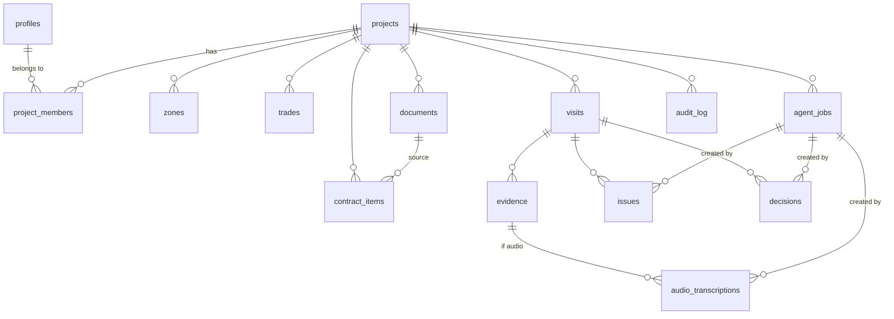

# Data model

> Status: **implemented in Phase 1**. Source of truth:
> [supabase/migrations/](../../supabase/migrations/) — enums, tables and RLS are fully
> commented there. TypeScript mirrors live in
> [packages/core/src/enums.ts](../../packages/core/src/enums.ts).

## Tables

| Table                  | Purpose                                                     |
| ---------------------- | ----------------------------------------------------------- |
| `profiles`             | User profile linked to `auth.users`                         |
| `projects`             | Renovation project                                          |
| `project_members`      | Memberships and roles per project (basis for RLS policies)  |
| `zones`                | Zones/rooms (kitchen, main bathroom, living room…)          |
| `trades`               | Trades (electrical, plumbing, carpentry…)                   |
| `visits`               | Site visits                                                 |
| `evidence`             | Evidence (photos, audio, video, documents) for a visit      |
| `audio_transcriptions` | Transcriptions (original + edited) of audio                 |
| `documents`            | Technical documents (plan, quote, technical specification…) |
| `contract_items`       | Budget line items                                           |
| `issues`               | Issues                                                      |
| `decisions`            | Pending decisions                                           |
| `agent_jobs`           | AI worker job queue                                         |
| `audit_log`            | Append-only log of relevant actions                         |

## Enums

Defined in `20260702120000_create_enums.sql` and mirrored in `packages/core`:

- `project_role`: owner, admin, editor, viewer
- `project_status`: active, paused, completed, archived
- `visit_status`: draft, published, archived
- `evidence_type`: photo, audio, video, document
- `document_type`: plan, quote, technical_memory, annex, invoice, warranty, change_order, other
- `issue_status`: ai_draft, open, in_review, waiting_builder, waiting_owner, resolved, closed, rejected
- `decision_status`: ai_draft, pending, approved, rejected, superseded, closed
- `priority`: low, medium, high, critical
- `job_type`: transcribe_audio, extract_visit, generate_visit_summary, suggest_issues, suggest_decisions, generate_weekly_summary
- `job_status`: pending, processing, completed, failed, cancelled

`review_state` (human_created, ai_draft, approved, edited, rejected) and `source` (human, ai)
are intentionally **text columns**, not SQL enums: the review workflow is still being built out
(Phases 6–7) and text keeps them cheap to evolve. They are validated app-side with Zod.

## Relationships

## Design notes

- **Every project data table carries `project_id`** with `on delete cascade`: deleting a project
  removes all its data, and RLS filters by membership on that column.
- **AI provenance**: AI-created rows carry `source = 'ai'`, `review_state = 'ai_draft'` and
  `created_by_job_id` pointing to the `agent_jobs` row. Flow: `ai_draft → edited/approved/rejected`.
- **`updated_at` is automatic** via the `set_updated_at` trigger on every mutable table.
  `audit_log` has no `updated_at`: it is append-only.
- **Transcripts are never destroyed**: `raw_transcript` is immutable in practice (no client
  insert/delete policies); users edit `edited_transcript`. Phase 6 extractions prefer the edited
  version.
- **Worker queue**: `agent_jobs` has a partial index on `status = 'pending'` for the polling
  query, plus `locked_at`/`locked_by`/`attempt_count` fields ready for Phase 5.
- **Data minimization**: `projects.address_label` is a label ("Barcelona flat"), not a full
  postal address.
- Nullable references (`zone_id`, `trade_id`, `visit_id`, …) use `on delete set null` so deleting
  a zone or trade never destroys visits or evidence.
