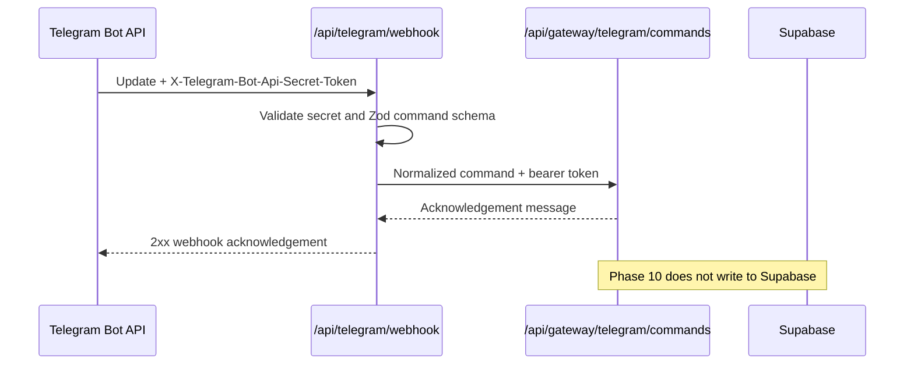

# Telegram gateway

> Status: **Phase 10 optional gateway**. Telegram is a relay into first-party server APIs. It is
> not a Supabase client, not an upload path and not an AI execution environment.

## Boundary

Telegram is intentionally narrow:

- `POST /api/telegram/webhook` receives Telegram Bot API updates.
- The webhook validates `X-Telegram-Bot-Api-Secret-Token`.
- Text commands are normalized with Zod schemas from `packages/core`.
- Normalized commands are forwarded to `TELEGRAM_GATEWAY_API_URL` with
  `Authorization: Bearer <TELEGRAM_GATEWAY_API_TOKEN>`.
- The Phase 10 first-party endpoint acknowledges command intents but does not create project
  rows, upload files, enqueue AI jobs or bypass RLS.



## Supported commands

| Command         | Phase 10 behavior                                                             |
| --------------- | ----------------------------------------------------------------------------- |
| `/start`        | Confirms that the gateway is connected                                        |
| `/help`         | Lists supported commands and the security boundary                            |
| `/status`       | Confirms that the first-party gateway endpoint is reachable                   |
| `/visit <note>` | Validates and forwards a visit-note intent; it does not create a database row |

Media messages are not accepted by the Telegram gateway. Use the web app for evidence uploads so
private Storage policies, file validation, project membership and evidence metadata stay in one
place. Photos remain evidence only; there is no OCR, image analysis or document intelligence.

## Environment variables

Configure these in the web runtime only. Never add `NEXT_PUBLIC_` to these names.

| Variable                     | Required | Secret | Notes                                                                |
| ---------------------------- | -------- | ------ | -------------------------------------------------------------------- |
| `TELEGRAM_WEBHOOK_SECRET`    | yes      | yes    | 16-256 chars from `A-Z`, `a-z`, `0-9`, `_`, `-`                      |
| `TELEGRAM_BOT_TOKEN`         | optional | yes    | BotFather token used only to send chat replies                       |
| `TELEGRAM_GATEWAY_API_URL`   | yes      | yes/no | First-party endpoint, usually `/api/gateway/telegram/commands`       |
| `TELEGRAM_GATEWAY_API_TOKEN` | yes      | yes    | Bearer token shared only by the webhook and first-party API endpoint |

Local example:

```bash
TELEGRAM_WEBHOOK_SECRET=replace_with_32_chars_or_more
TELEGRAM_BOT_TOKEN=123456:replace-with-botfather-token
TELEGRAM_GATEWAY_API_URL=http://localhost:3000/api/gateway/telegram/commands
TELEGRAM_GATEWAY_API_TOKEN=replace_with_a_long_random_gateway_token
```

Telegram requires a public HTTPS webhook URL for the hosted Bot API. For local manual testing,
use a trusted tunnel to your local web app, then set the webhook to the tunnel URL.

## Webhook setup

After deploying the web app, register the webhook:

```bash
curl -X POST "https://api.telegram.org/bot$TELEGRAM_BOT_TOKEN/setWebhook" \
  -d "url=https://<web-domain>/api/telegram/webhook" \
  -d "secret_token=$TELEGRAM_WEBHOOK_SECRET" \
  -d 'allowed_updates=["message","edited_message"]'
```

Check status:

```bash
curl "https://api.telegram.org/bot$TELEGRAM_BOT_TOKEN/getWebhookInfo"
```

Remove the webhook:

```bash
curl -X POST "https://api.telegram.org/bot$TELEGRAM_BOT_TOKEN/deleteWebhook"
```

## Security checklist

- The webhook secret is random and configured in Telegram `setWebhook`.
- Telegram secrets are server-only web runtime variables.
- The Vercel/web project still does not contain `SUPABASE_SERVICE_ROLE_KEY`.
- The first-party command endpoint rejects requests without the bearer token.
- No route in Phase 10 imports a Supabase client or writes project data directly.
- Real project mutations from Telegram require a future account-linking design that maps a
  Telegram sender to an authenticated app user and enforces `project_members` permissions.

## Implementation notes

The Phase 10 implementation lives in:

- `packages/core/src/telegram.ts` for Telegram update, command and config validators.
- `apps/web/app/api/telegram/webhook/route.ts` for the Telegram webhook.
- `apps/web/app/api/gateway/telegram/commands/route.ts` for the first-party command contract.

The gateway deliberately has no Telegram SDK dependency. It uses the official Bot API over
`fetch`, keeping Telegram optional and outside the core product runtime.
