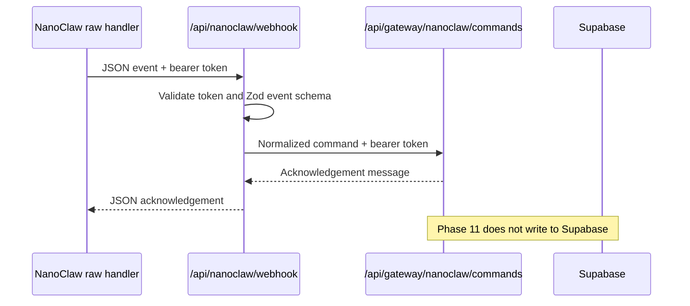

# NanoClaw gateway

> Status: **Phase 11 optional gateway**. NanoClaw is a caller of first-party server APIs. It is
> not a Supabase client, not an upload path and not an AI execution environment inside
> `reforma-agent`.

## Boundary

NanoClaw is intentionally narrow:

- `POST /api/nanoclaw/webhook` receives a small JSON event from a NanoClaw raw handler or
  equivalent integration.
- The webhook requires `Authorization: Bearer <NANOCLAW_WEBHOOK_TOKEN>`.
- Text commands are normalized with Zod schemas from `packages/core`.
- Normalized commands are forwarded to `NANOCLAW_GATEWAY_API_URL` with
  `Authorization: Bearer <NANOCLAW_GATEWAY_API_TOKEN>`.
- The Phase 11 first-party endpoint acknowledges command intents but does not create project
  rows, upload files, enqueue AI jobs or bypass RLS.

NanoClaw's public channel docs describe a shared webhook server with routes such as
`/webhook/{path}` and a `registerWebhookHandler(path, handler)` escape hatch for raw handlers.
Use that raw handler to call the Reforma webhook below; do not give NanoClaw Supabase keys.



## Payload contract

The NanoClaw raw handler should POST this shape:

```json
{
  "eventId": "nc_evt_123",
  "agentGroupId": "renovation-agent",
  "conversationId": "thread-456",
  "senderId": "operator-789",
  "text": "/status",
  "metadata": {
    "channel": "cli"
  }
}
```

Only `text` is required. The optional ids are preserved for audit-friendly provenance in later
first-party APIs, but Phase 11 does not persist them.

## Supported commands

| Command                   | Phase 11 behavior                                                         |
| ------------------------- | ------------------------------------------------------------------------- |
| `/help`                   | Lists supported commands and the security boundary                        |
| `/status`                 | Confirms that the first-party gateway endpoint is reachable               |
| `/visit <note>`           | Validates and forwards a visit-note intent; it does not create a row      |
| `/issue <note>`           | Validates and forwards an issue intent; it does not create an issue       |
| `/decision <note>`        | Validates and forwards a decision intent; it does not create a decision   |
| `/weekly-summary <range>` | Validates and forwards a summary intent; it does not enqueue a worker job |

NanoClaw payloads are text-only in Phase 11. Use the web app for evidence uploads, review
actions and project data entry. There is no OCR, image analysis, document intelligence or
NanoClaw-triggered AI job execution.

## Environment variables

Configure these in the web runtime only. Never add `NEXT_PUBLIC_` to these names.

| Variable                     | Required | Secret | Notes                                                                |
| ---------------------------- | -------- | ------ | -------------------------------------------------------------------- |
| `NANOCLAW_WEBHOOK_TOKEN`     | yes      | yes    | Bearer token NanoClaw sends to `/api/nanoclaw/webhook`               |
| `NANOCLAW_GATEWAY_API_URL`   | yes      | yes/no | First-party endpoint, usually `/api/gateway/nanoclaw/commands`       |
| `NANOCLAW_GATEWAY_API_TOKEN` | yes      | yes    | Bearer token shared only by the webhook and first-party API endpoint |

Local example:

```bash
NANOCLAW_WEBHOOK_TOKEN=replace_with_a_long_random_webhook_token
NANOCLAW_GATEWAY_API_URL=http://localhost:3000/api/gateway/nanoclaw/commands
NANOCLAW_GATEWAY_API_TOKEN=replace_with_a_long_random_gateway_token
```

## Manual smoke test

With the web app running and the NanoClaw environment variables set:

```bash
curl -X POST "http://localhost:3000/api/nanoclaw/webhook" \
  -H "Authorization: Bearer $NANOCLAW_WEBHOOK_TOKEN" \
  -H "Content-Type: application/json" \
  -d '{"eventId":"nc_evt_local","text":"/status","metadata":{"channel":"cli"}}'
```

Expected response:

```json
{
  "ok": true,
  "forwarded": true,
  "message": "The reforma-agent NanoClaw gateway is online. Open the web app to view project dashboards and review drafts."
}
```

## Security checklist

- The NanoClaw raw handler sends a long random bearer token.
- NanoClaw secrets are server-only web runtime variables.
- The Vercel/web project still does not contain `SUPABASE_SERVICE_ROLE_KEY`.
- The first-party command endpoint rejects requests without its separate bearer token.
- No route in Phase 11 imports a Supabase client or writes project data directly.
- Real project mutations from NanoClaw require a future account-linking design that maps a
  NanoClaw sender to an authenticated app user and enforces `project_members` permissions.

## Implementation notes

The Phase 11 implementation lives in:

- `packages/core/src/nanoclaw.ts` for NanoClaw event, command and config validators.
- `apps/web/app/api/nanoclaw/webhook/route.ts` for the external NanoClaw webhook.
- `apps/web/app/api/gateway/nanoclaw/commands/route.ts` for the first-party command contract.

The gateway deliberately has no NanoClaw SDK dependency. It accepts JSON over HTTP and keeps
NanoClaw optional and outside the core product runtime.
