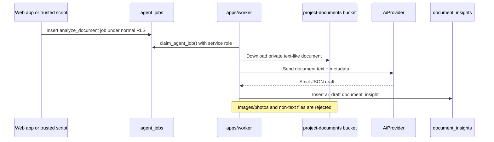

# Document intelligence

> Status: **Phase 12 optional worker feature**. Document intelligence is text-only, worker-only
> and reviewable. It does not analyze photos, OCR PDFs, parse Office binaries or run inside web
> requests.

## Boundary

Phase 12 adds:

- `analyze_document` as a worker job type.
- `document_insights` as the reviewable draft table.
- Zod schemas for job input, provider output and completed job metadata.
- `AiProvider.analyzeDocument()` for mock/local and OpenAI structured-output providers.

Phase 12 does not add:

- A UI enqueue button.
- OCR.
- Image/photo analysis.
- PDF parsing.
- Office document parsing.
- Automatic issue or decision extraction from documents.
- AI work inside `apps/web` route handlers or server actions.

## Flow



## Job contract

Input:

```json
{
  "documentId": "uuid"
}
```

Completed output:

```json
{
  "documentInsightId": "uuid",
  "documentId": "uuid",
  "projectId": "uuid",
  "provider": "mock | openai",
  "model": "model name"
}
```

## Accepted documents

The worker accepts only text-like documents where `documents.mime_type` starts with `text/`, such
as:

- `text/plain`
- `text/csv`

The worker permanently rejects:

- `image/*` files, including plan screenshots or photographed documents.
- PDFs.
- Word, Excel and other Office binaries.
- Any other non-text MIME type.

This is intentional. Processing those files safely requires a separate parser/OCR design and is
outside Phase 12.

## Output

`document_insights` rows contain:

- `title`
- `summary`
- `key_points`
- `suggested_actions`
- `source = 'ai'`
- `review_state = 'ai_draft'`
- `created_by_job_id`

The content is a draft. Humans must review it before relying on it.

## RLS

`document_insights` follows the same pattern as weekly summaries:

| Operation | Access                                     |
| --------- | ------------------------------------------ |
| select    | project members                            |
| insert    | worker/service role only                   |
| update    | owner/admin/editor through normal RLS      |
| delete    | worker/service role only; no client delete |

The web app still uses only the publishable Supabase key. The worker remains the only runtime that
uses `SUPABASE_SERVICE_ROLE_KEY`.

## Manual smoke test

1. Upload a `text/plain` project document through the existing document UI.
2. Insert a job as an owner/admin/editor through a trusted RLS-scoped path or SQL during local
   smoke testing:

```sql
insert into public.agent_jobs (project_id, type, input, created_by)
values (
  '<project-id>',
  'analyze_document',
  jsonb_build_object('documentId', '<document-id>'),
  '<user-id>'
);
```

3. Run one worker pass:

```bash
WORKER_RUN_ONCE=true pnpm --filter @reforma/worker dev
```

4. Confirm the job is completed and a `document_insights` row exists with `review_state =
'ai_draft'`.

## Provider behavior

Without `OPENAI_API_KEY`, the mock provider writes deterministic local drafts. With
`OPENAI_API_KEY`, the existing text model (`OPENAI_TEXT_MODEL`, default `gpt-4o-mini`) receives
only the extracted text and document/project metadata. It is instructed not to infer from photos,
OCR, binary file contents or unstated facts.
